# Week7 - EEZStudio
## PART 1: Making a new project

Download and install, and run EEZStudio:

https://www.envox.eu/studio/studio-introduction/

https://github.com/eez-open/studio/releases

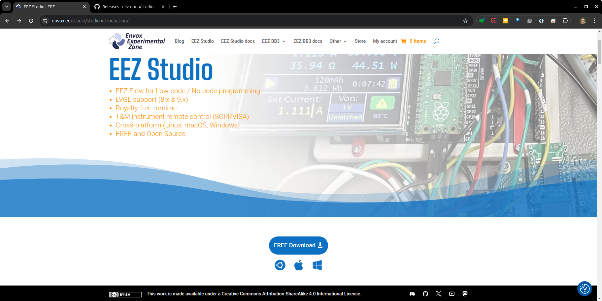

File – New Project. Select LVGL, select version 9.X . Type in a project name and select a directory to store your LVGL projects on. Click create project.

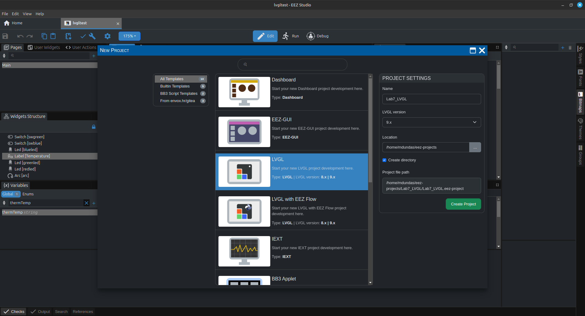

Click on the blue cog wheel for settings.

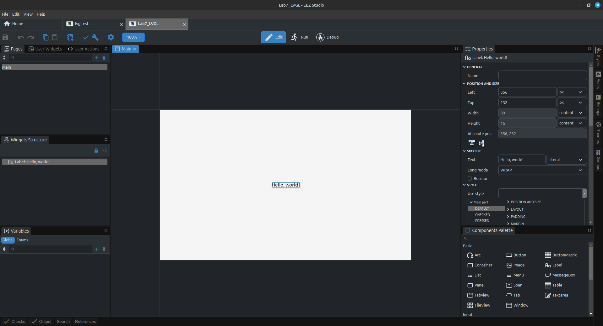

Change Display width to 320 and height to 240. Click the main tab beside the blue settings tab.

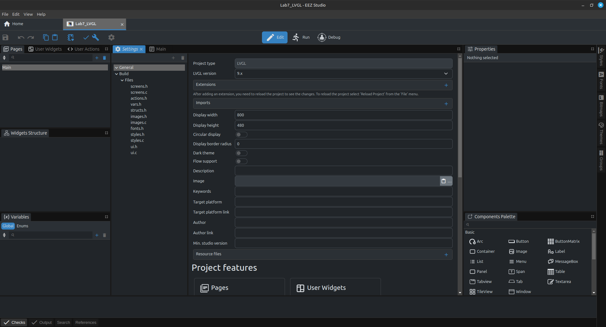

In your STM32 project make a “ui” folder under the Core/Src folder

Right click on your main project name and select properties. Add the Core/Src/ui workspace path.

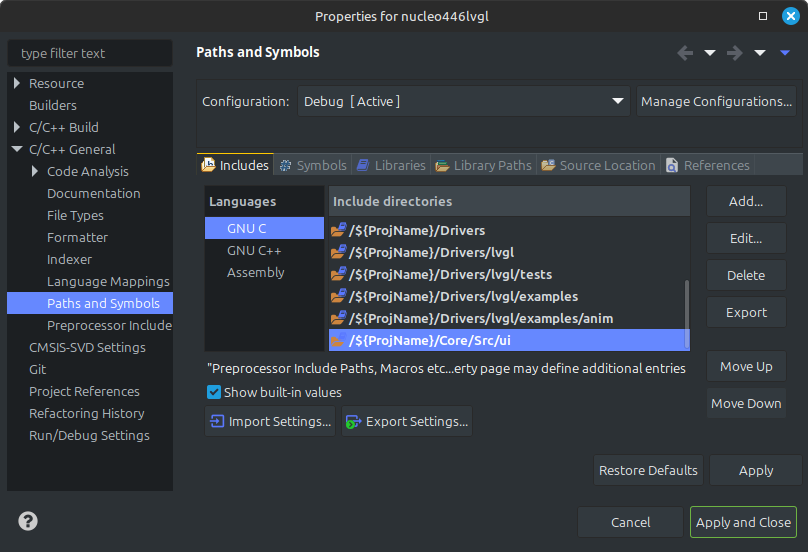

Under settings in EEZStudio, select Build. On the right there is an option to select the destination folder. Use the search folders (...) to locate the ui directory that was just made in the STM32CubeIDE. This allows you to send the compiled code to a project directory. 

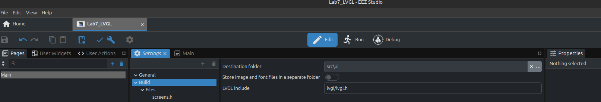

In main change the width and height to 320 and 240.

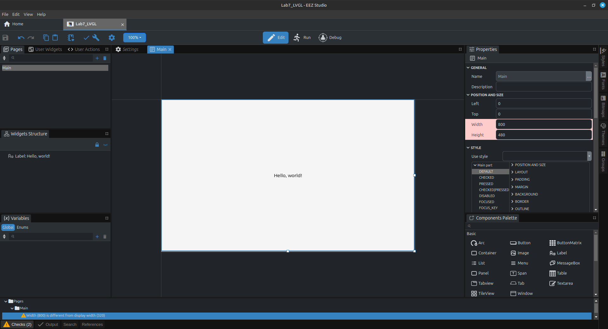

On the right side expand the background listing and select the drop down and select a color from the color picker.

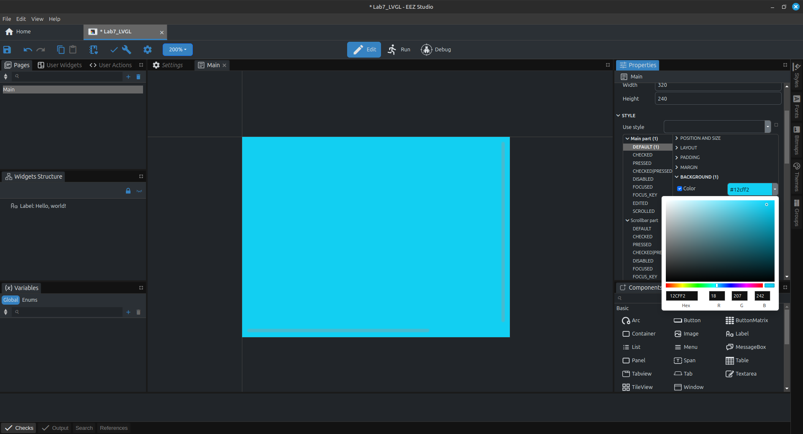

Scroll the right hand side down until you see a number of check boxes.
Unselect scrollable.
On the left side there is a HelloWorld label under Widget Structure.
Right click and delete it.

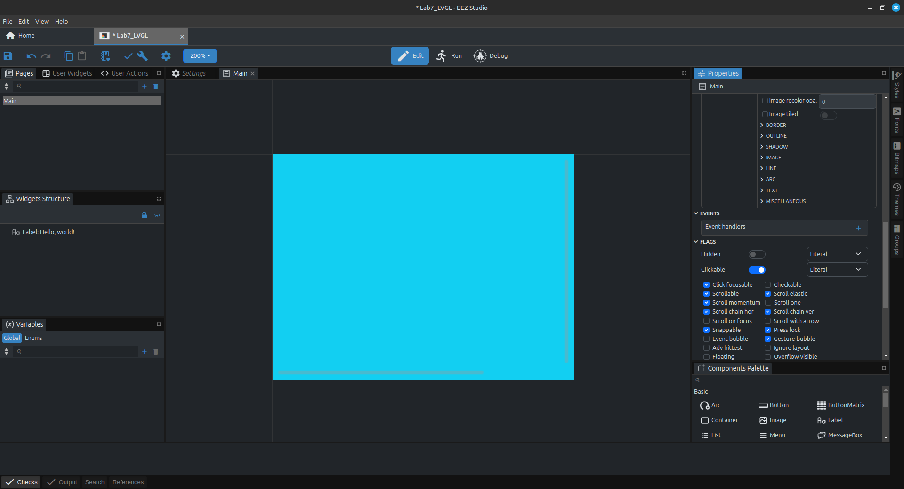

From the components palette on the right, drag a label to the screen. Enter your text as “ECET 260” and change its color.

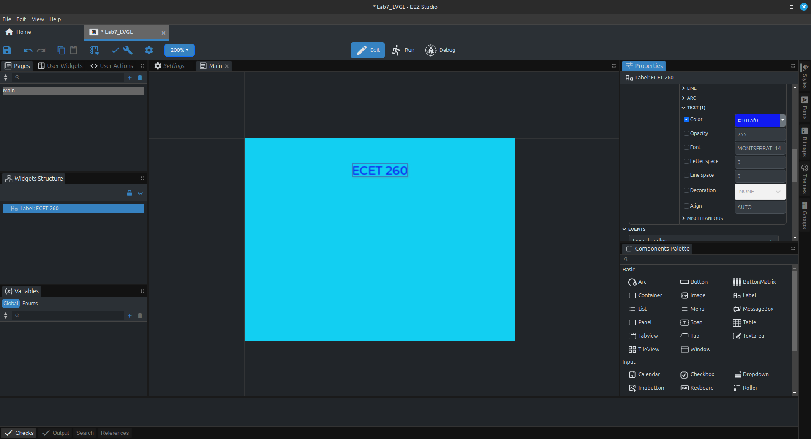

Drag a button and a LED onto the screen layout. Name the Button button and the LED led.

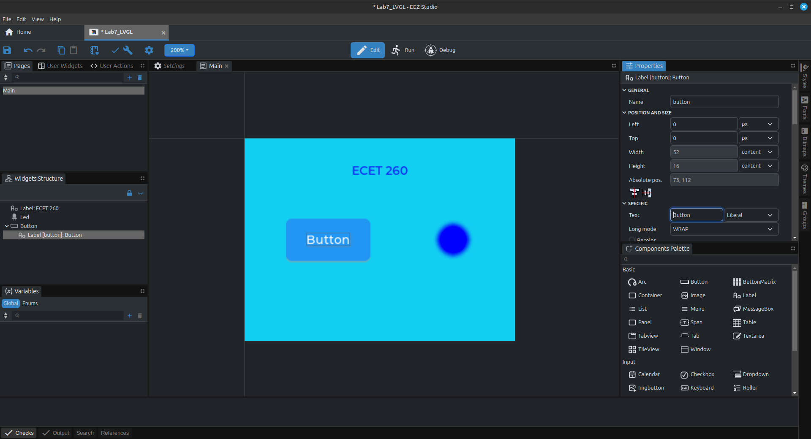

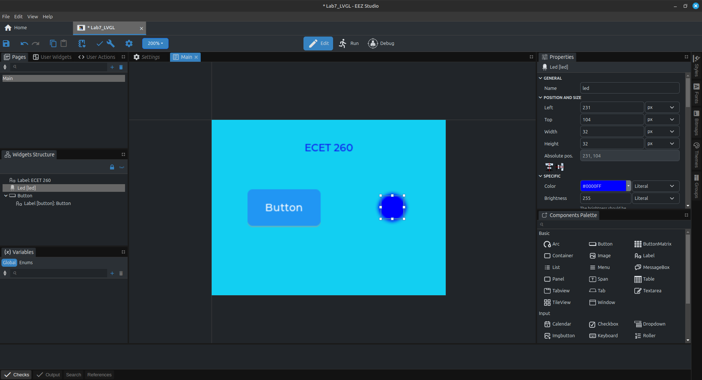

Include ui.h, vars.h, and actions.h to access EEZstudio files

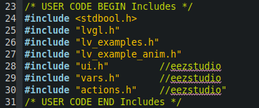

Initialize it with ui_init

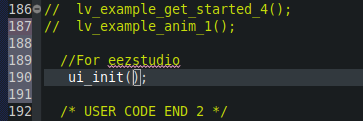

Put the ui_tick function just after the Touch_GETXYtouch function.

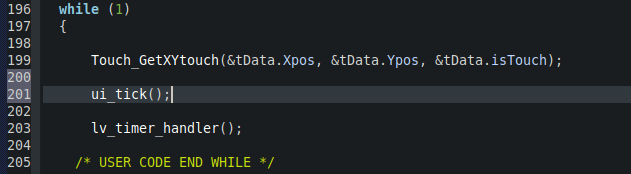

Click on the button (not the label on on the button). 
On the left side under ‘User Actions’ click + .
Add a new action called redLedEvent and have the event be PRESSED.
Add a new action called redLedEvent and have the event be RELEASED.

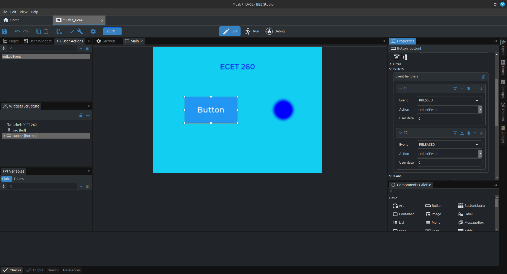

In main.c in UserCode0:

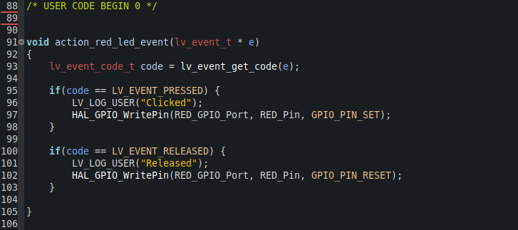

In your while(1) loop in main, add  the polling for your blue button, B1 and change the intensity of the software LED.

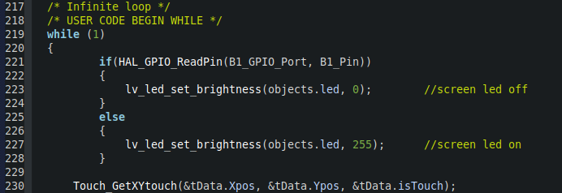

## PART 2: Hardware Configuration

Configure the LED and the KEY pins.

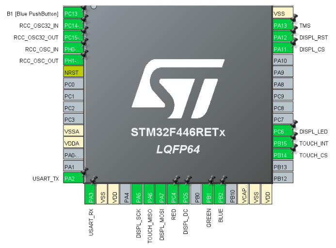